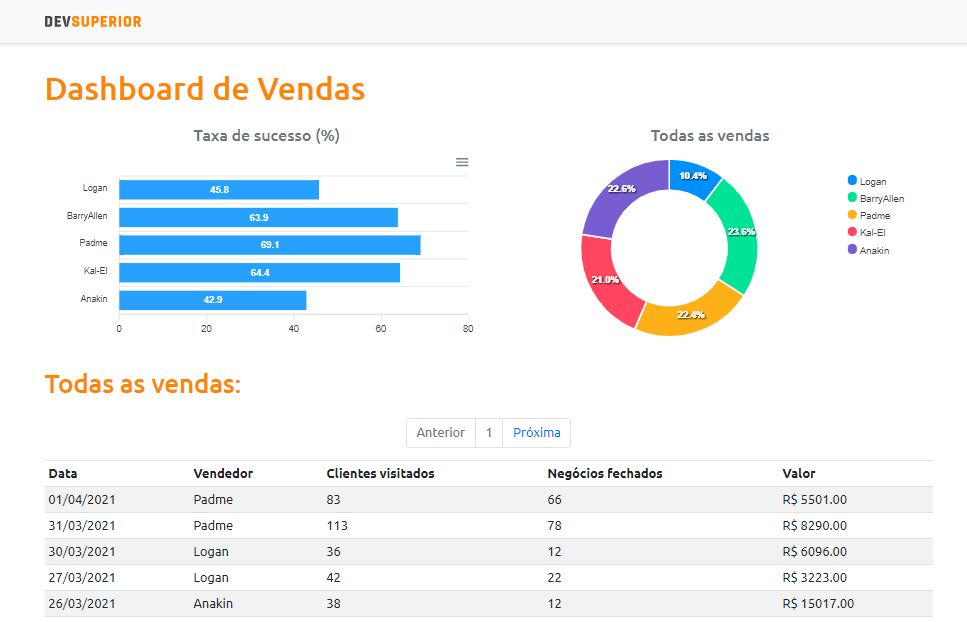

# Projeto DSVendas

DSVendas é uma aplicação full stack, onde exibe um dashboard de vendas a partir de dados fornecidos por um back end construído com Spring Boot e consumida por um front end construído com React.

Projeto desenvolvido durante as aulas da Semana Spring React - SDS 3.0 da DEV Superior.

# Para acessar o projeto online clique [aqui](https://sds3-dsvendas-rsa.netlify.app/)



# 🛠 Tecnologias:
## Back-end:
* Java
* Spring Boot
* Spring Data JPA
* Spring Security
* Maven

## Front-end:
* JavaScript
* TypeScript
* React
* HTML
* CSS
* Bootstrap

## Banco de Dados:
* PostgreSQL 


# 🚀 Implantação em produção:
* Back-end: Heroku
* Front-end: Netlify


#  Como executar o projeto:

## Back-end:
 Requisitos: Java 11
```
# clonar repositório:
git clone https://github.com/rodrisoares/projeto-sds3

#  entrar na pasta do projeto back-end:
cd backend

#  executar o projeto:
./mvnw spring-boot:run

# acessar o localhost:
http://localhost:8080
```

## Front-end:
Requisitos: npm / yarn
```
# clonar repositório:
git clone https://github.com/rodrisoares/projeto-sds3

# entrar na pasta do projeto front-end:
cd frontend

#  instalar dependências:
yarn install

#  executar o projeto:
yarn start

# acessar o localhost:
http://localhost:3000
```

# 📚 Estrutura de camadas:


